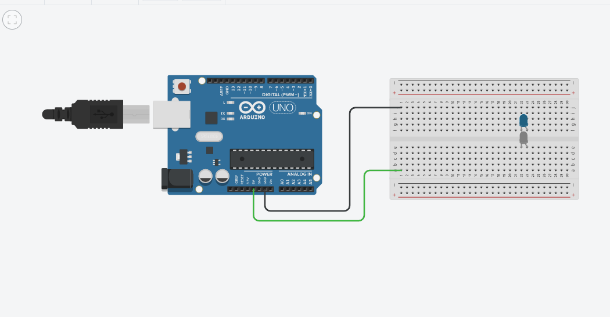
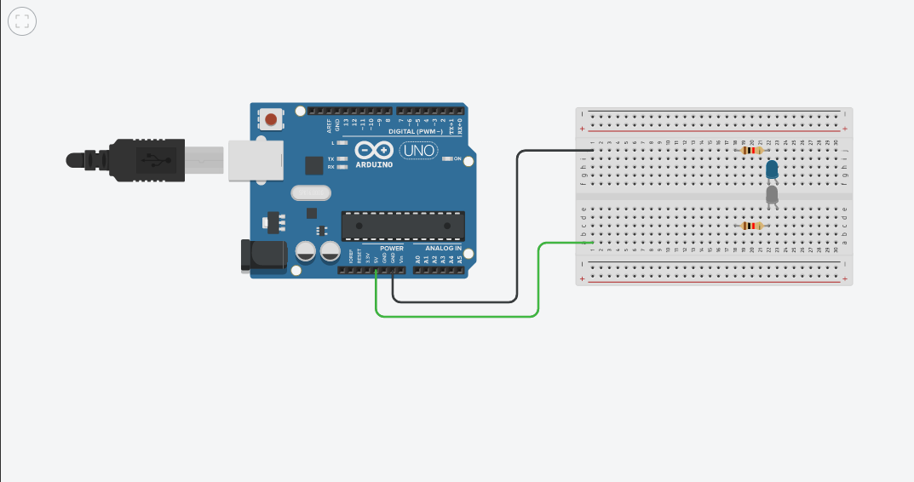
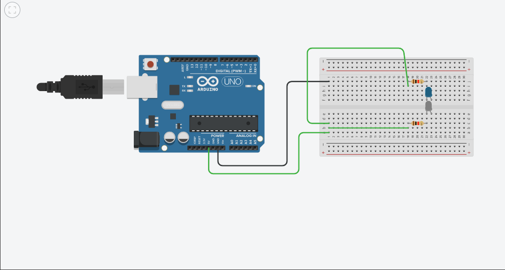
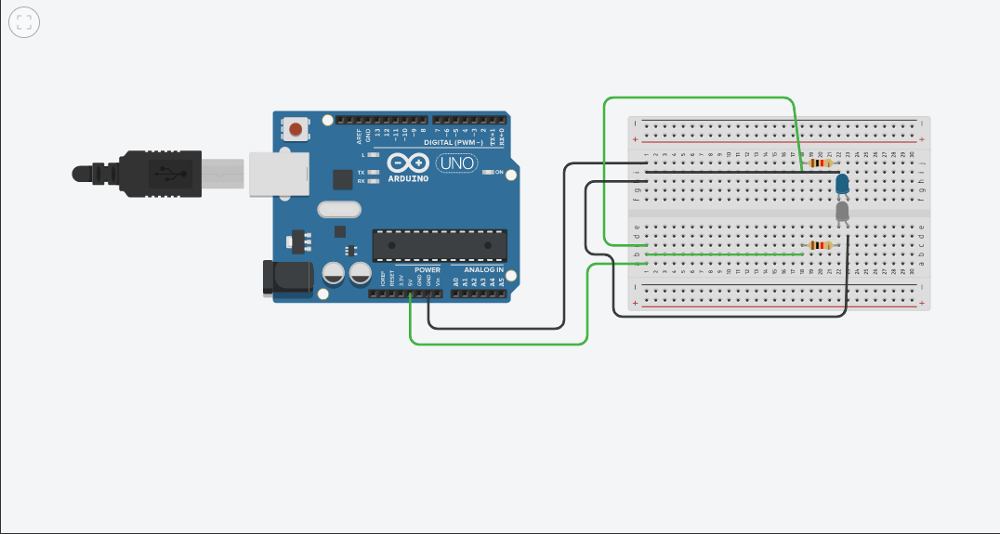

# MANUAL DE INSTALAÇÃO E USO
## ARDUINO UNO E SENSOR TCRT5000

---

1. Com um Arduino Uno, conecte um fio no pino de 5v e outro em uma fileira da protoboard:

2. Conecte da mesma maneira o fio ground, preferencialmente do lado oposto:

3. Coloque o sensor na protoboard, aqui representado por dois leds, um azul e outro branco:

4. Adicione dois resistores juntos ao na direção de uma das "pernas" do sensor:

5. Conecte fios de energia nas duas "pernas" dos resistores que estão mais afastadas do sensor:

6. Conecte dois fios pretos ground nas laterais dos sensores:

7. Conecte o fio do sensor na porta 7 e no socket entre o sensor preto (no caso branco) e o resistor:

---

## Segue demais imagens de fotos para melhor comprensão:
